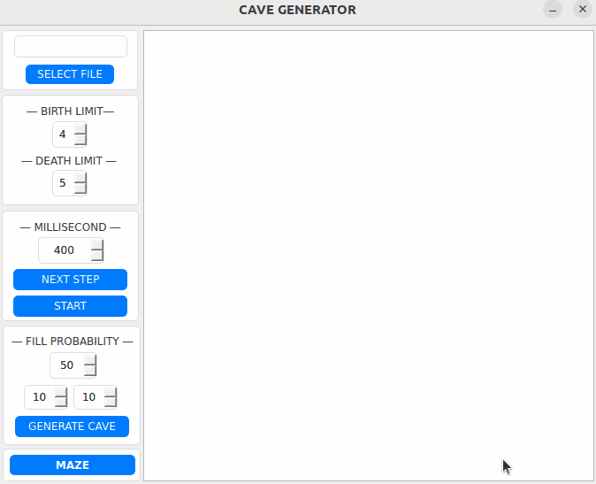

# Maze

**Maze** — это программное обеспечение для создания, отображения и анализа идеальных лабиринтов и пещер. Программа разработана на C++ и предлагает удобный графический интерфейс для визуализации лабиринтов и пещер, а также инструменты для их генерации и решения.

## Содержание

- [Особенности](#особенности)
- [Участники проекта](#участники-проекта)
- [Обзор программы](#обзор-программы)
- [Установка](#установка)
- [Unit-тесты](#unit-тесты)
- [Техническое задание](#техническое-задание)
  - [Основное задание](#основное-задание)
  - [Дополнительное задание](#дополнительное-задание-генерация-пещер)

## Особенности

- **Генерация идеальных лабиринтов:** Возможность генерировать идеальные лабиринты по алгоритму Эллера.
- **Визуализация лабиринтов:** Загрузка и отображение лабиринтов с интерфейса программы.
- **Генерация пещер:** Использование клеточных автоматов для создания пещер.
- **Решение лабиринтов:** Возможность визуализации пути между двумя точками в лабиринте с помощью алгоритма A* pathfinding.
- **Расширенные настройки:** Настройка параметров генерации и визуализации.

## Участники проекта

| Имя | Обязанности и вклад |
| --- | --- |
|   **―― EDUARD G. ――** | - Реализация генерации лабиринтов и пещер  - Дизайн и интерфейс  - Алгоритм нахождения пути в лабиринте  - Файловый парсер  - Создание документации |
|   **―― NUPGOD ――** | - Помощь в тестировании программы  - Создание Unit Test'ов |

## Обзор программы

### Основной вид

Программа **Maze** обладает интуитивно понятным графическим интерфейсом, который позволяет пользователям легко взаимодействовать с различными функциями. Главное окно включает в себя панель инструментов для создания и загрузки лабиринтов, а также панель управления для их анализа и визуализации.

Пользователи могут загружать предварительно сохранённые лабиринты из файлов, используя функцию "Открыть" в главном меню. Это позволяет легко поделиться и просмотреть лабиринты, созданные в других источниках или сохранённые в предыдущих сессиях работы с программой.

### Генерация идеального лабиринта

С помощью алгоритма Эллера программа может автоматически генерировать идеальные лабиринты заданных размеров. Генерация происходит в реальном времени, и пользователи могут наблюдать за каждым шагом процесса, что делает этот процесс образовательным и увлекательным.

### Нахождение пути в лабиринте

Функция решения лабиринта позволяет пользователю указать начальную и конечную точки, и программа отобразит кратчайший путь между ними с использованием алгоритма A* для поиска пути. Это особенно полезно для образовательных целей и для проверки сложности лабиринтов.

### Генерация пещер

Раздел генерации пещер использует клеточные автоматы для создания более сложных и неоднородных структур, которые могут имитировать реальные пещеры. Эта функция обеспечивает дополнительный уровень взаимодействия и исследования, позволяя пользователям экспериментировать с различными параметрами и наблюдать за их влиянием на конечные формы пещер.

## Установка

**Требования**: Установленные `gcc`, `make` и `qmake6`.

### Цели MAKEFILE:

- **install** \
    Устанавливает программу в папку build.

- **uninstall** \
    Удаляет программу.

- **dvi** \
    Открывает документацию по проекту.

- **dist** \
    Генерирует дистрибутив .tgz с исполняемым файлом и необходимой документацией.

- **test** \
    Запуск тестирования модулей.

- **gcov_report** \
    Генерирует html отчет с отображением покрытия всех функций тестами.

- **valgrind** \
    Инициализирует проверку проекта с помощью valgrind.

## Unit-тесты

Ниже представлена гифка, демонстрирующая процесс выполнения и результаты Unit-тестов программы **Maze**. Эти тесты обеспечивают верификацию корректности работы ключевых компонентов программы, включая генерацию лабиринтов, алгоритмы поиска путей и загрузку данных из файлов.

Тестирование является важной частью разработки программного обеспечения, поскольку помогает обнаруживать и исправлять ошибки на ранних этапах. В **Maze** используется набор Unit-тестов, разработанных с помощью фреймворка Google Test, для обеспечения стабильности и надежности программы. Эти тесты покрывают все основные функциональные возможности и помогают поддерживать высокое качество кода по мере его развития и модификации.

## Техническое задание

### Основное задание.

#### Part 1. Реализация проекта Maze

Необходимо реализовать программу Maze, позволяющую генерировать и отрисовывать идеальные лабиринты и пещеры:

- Программа должна быть разработана на языке C++ стандарта C++17
- Код программы должен находиться в папке src
- При написании кода необходимо придерживаться Google Style
- Сборка программы должна быть настроена с помощью Makefile со стандартным набором целей для GNU-программ: all, install, uninstall, clean, dvi, dist, tests. Установка должна вестись в любой другой произвольный каталог
- В программе должен быть реализован графический пользовательский интерфейс на базе любой GUI-библиотеки с API для C++ (Qt, SFML, GTK+, Nanogui, Nngui, etc.)
- В программе предусмотрена кнопка для загрузки лабиринта из файла.
- Максимальный размер лабиринта - 50х50
- Загруженный лабиринт должен быть отрисован на экране в поле размером 500 x 500 пикселей
- Толщина «стены» - 2 пикселя
- Размер самих ячеек лабиринта вычисляется таким образом, чтобы лабиринт занимал всё отведенное под него поле

#### Part 2. Генерация идеального лабиринта

Добавить возможность автоматической генерации идеального лабиринта. \
Идеальным считается лабиринт, в котором из каждой точки можно попасть в любую другую точку ровно одним способом.

- Генерировать лабиринт нужно согласно **алгоритму Эллера**
- Сгенерированный лабиринт не должен иметь изолированных областей и петель
- Должно быть обеспечено полное покрытие unit-тестами модуля генерации идеального лабиринта
- Пользователем вводится только размерность лабиринта: количество строк и столбцов
- Сгенерированный лабиринт должен сохраняться в файл.
- Созданный лабиринт должен отображаться на экране.

#### Part 3. Решение лабиринта

Добавить возможность показать решение _любого_ лабиринта, который сейчас изображен на экране:
- Пользователем задаются начальная и конечная точки
- Маршрут, являющийся решением, отобразить линией толщиной 2 пикселя, проходящей через середины всех ячеек лабиринта, через которые пролегает решение
- Цвет линии решения должен быть отличным от цветов стен и поля
- Должно быть обеспечено полное покрытие unit-тестами модуля решения лабиринта

### Дополнительное задание. Генерация пещер

Добавить генерацию пещер с использованием клеточного автомата:
- Пользователем выбирается файл, в котором описана пещера.
- Для отображения пещер использовать отдельное окно или вкладку пользовательского интерфейса
- Максимальный размер пещеры - 50 х 50
- Загруженная пещера должна быть отрисована на экране в поле размером 500 x 500 пикселей
- Пользователем задаются пределы «рождения» и «смерти» клетки, а также шанс на начальную инициализацию клетки
- Пределы «рождения» и «смерти» могут иметь значения от 0 до 7
- Клетки за границей пещеры считаются живыми
- Должен быть предусмотрен пошаговый режим отрисовки результатов работы алгоритма в двух вариантах:
  - По нажатию на кнопку следующего шага отрисовывается очередная итерация работы алгоритма
  - По нажатию на кнопку автоматической работы запускается отрисовка итераций работы алгоритма с частотой 1 шаг в `N` миллисекунд, где число миллисекунд `N` задаётся через специальное поле в пользовательском интерфейсе
- Размер клеток в пикселях вычисляется таким образом, чтобы пещера занимала всё отведенное под него поле
- Должно быть обеспечено полное покрытие unit-тестами модуля генерации пещер
